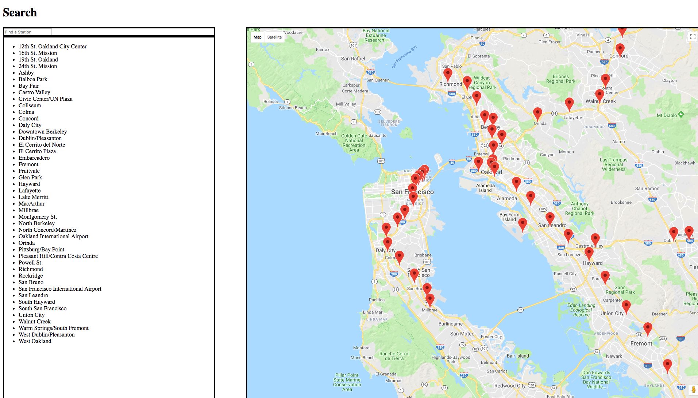

# BART Station Map
A Knockout.js website that utilizes the Google Maps and BART API to display locations of every station in the Bay Area that can refer to local attractions, food and shopping nearby. Website also features live searching.

## Installation
1) Navigate to the project folder through your terminal
2) Open app.html with your preferred browser

## Usage Example

## Author
Steven Huynh

[Linkedin](https://www.linkedin.com/in/stevenhuynh17/)
